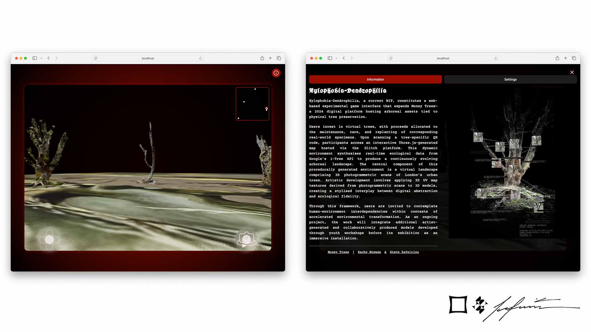

# Xylophobia-Dendrophylia

[](https://opensource.org/licenses/MIT)


An experimental 3D browser environment bridging digital art and ecological awareness through interactive tree models. Built with React and Three.js.



## 🌳 Overview

Xylophobia-Dendrophylia is an immersive web experience that transforms photogrammetric scans of urban trees into an infinite virtual forest. Part of the _Money Trees_ ecosystem (2024), this project enables:

- Interactive exploration of 3D tree models
- Real-world ecological data integration via Google's i-tree
- Mobile-responsive environment with game-like controls

The project serves as both an artistic installation and educational tool, encouraging users to reflect on environmental stewardship through a blend of digital/physical interactions.

This project is the result of a collaborative effort by [Rachy Mcewan](https://rachymcewan.com/) and [Steve Zafeiriou](https://stevezafeiriou.com/).

## ✨ Features

### Core Components

- **3D Environment**  
  Rendered with Three.js and React Three Fiber
- **Dynamic Models**  
  Photogrammetric scans of London's urban trees
- **Real-Time Data**  
  Ecological signals from physical tree counterparts
- **Mobile First**  
  Optimized touch controls and responsive UI

### Interaction System

| Component         | Description                          |
| ----------------- | ------------------------------------ |
| Joystick Controls | Dual virtual joysticks for movement  |
| Model Selection   | Community-voted tree model ranking   |
| QR Code Access    | Physical/digital tree linking        |
| Info System       | Educational popups with project docs |

## 🛠️ Technologies

**Frontend**

```text
React 18          - Component architecture
Three.js/r3f      - 3D rendering pipeline
Styled-Components - CSS-in-JS styling
React Icons       - UI icons
React Router      - Navigation system
```

**Data**

```text
i-tree API       - Ecological metrics
GLTF/GLB         - 3D model format
Photogrammetry   - Tree scanning technique
```

## 🚀 Installation

1. Clone repository

```bash
git clone https://github.com/stevezafeiriou/xylophobia-dendrophylia.git
cd xylophobia-dendrophylia
```

2. Install dependencies

```bash
npm install
```

3. Start development server

```bash
npm start
```

## 📖 Usage

### Basic Interaction

1. **Model Selection**
   Choose from community-ranked tree models
2. **Movement**
   Left joystick - Camera position
   Right joystick - Camera rotation
3. **Info Access**
   Click (i) icon for project documentation

### Advanced Features

```bash
# Environment Variables
REACT_APP_ITREE_KEY=your_api_key
REACT_APP_MAP_ZOOM=1.5
```

## 🎨 Project Structure

```text
src/
├── components/       # React components
│   ├── Scene/        # Three.js environment
│   ├── Joystick/     # Control system
│   └── Popup/        # Info modal system
├── data/             # Model metadata
├── styles/           # Global styling
└── public/           # Static assets
    └── models/       # GLTF/GLB files
```

## 🌱 Contributing

1. Fork the repository
2. Create feature branch

```bash
git checkout -b feature/new-tree-model
```

3. Commit changes

```bash
git commit -m 'Add: New oak tree model'
```

4. Push to branch

```bash
git push origin feature/new-tree-model
```

5. Open pull request

## To Do

1. Fix the joystick controls (the camera movement is currently inverted).

## 📜 License

MIT License - See [LICENSE](LICENSE) for details
